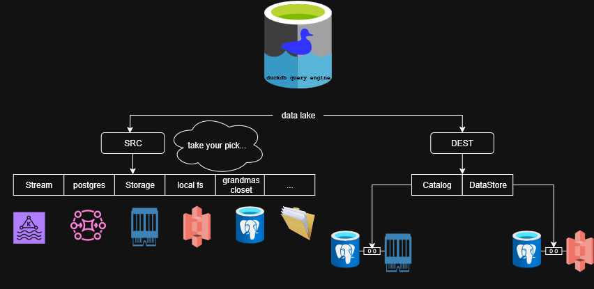

# DuckLake (SDK)
A super quick, no-nonsense guide to wiring up your lake.

basic infrastructure for a datalake operating on top of (ducklake,duckdb,postgress,kafka,minio[s3])


## Getting Started
there are some backing services you need to run in order to use primary functionallity:
```bash
cd infrastructure/
docker compose up 
```
this command should make these services availabe using default environment variables:

- kafka [http://localhost:9092] 
- kafka-ui [http://localhost:28080]
- minio [s3://localhost:9000]
- minio-console [http://localhost:9001]
- postgres [postgres://localhost:5432]
- pg-admin [http://localhost:18888]

each of these sevices will initiate by reading these environement variables:
- postgres:
    - PG_ADVERT_PORT: default=9000
    - PG_USER: default='pgadmin'
    - PG_PASSWORD: default='password'
    - PG_VOLUME_DIR: default='./pg_data'
- pgadmin:
    - PGADMIN_ADVERT_PORT: default=18888
    - PGADMIN_USER: default='pgadmin@email.com'
    - PGADMIN_DEFAULT_PASSWORD: default='password'
    - PGADMIN_VOLUME_DIR: default='./pgadmin_data'
- minio:
    - MINIO_ADVERT_PORT: default=9000
    - MINIOCONSOLE_ADVERT_PORT: default=9001
    - MINIO_ACCESS_KEY: default='minio'
    - MINIO_SECRET_KEY: default='password'
    - MINIO_VOLUME_DIR: default='./minio_data'
- kafka:
    - KAFKA_BROKER_PORT: default=9092
    - KAFKA_CONTROLLER_PORT: default=19292
    - KAFKA_INTERNAL_PORT: default=29092
    - KAFKA_HOST_ADDRESS: default=172.16.3.246 (must set to your exposed IP)
    - KAFKA_VOLUME_DIR: default='./kafka_data'
- kafka-ui
    - KAFKA_UI_PORT: default=18080


You point the project at:
- where your lake should live (DEST), and
- where your data is coming from (SRC),

by editing one file: `./resources/config.yml`.

That’s it. The tooling reads this config and does the rest.


---

## TL;DR

1) Open `./resources/config.yml`  
2) Set your DEST (where the lake lives)  
3) Pick a SRC (what you’re reading from)  
4) Install deps:

The config file (resources/config.yml) 

There are two top-level keys: DEST and SRC. 
DEST = where your lake “lives” 

DEST has two parts: catalog and storage. 

    catalog 
        This is your relational database that stores the lake’s catalog tables (schemas, table definitions, etc.).
        Default: Postgres.
        Docs:
            What is a catalog DB: https://ducklake.select/docs/stable/duckdb/usage/choosing_a_catalog_database 
            Catalog tables spec: https://ducklake.select/docs/stable/specification/tables/overview 
             
         

    storage 
        This is where the actual data files go (the “data-path” of your lake).
        Default: MinIO (S3-compatible).
        Docs:
            Choosing storage: https://ducklake.select/docs/stable/duckdb/usage/choosing_storage 
            Connecting to data-path: https://ducklake.select/docs/stable/duckdb/usage/connecting 
             
         
     

In short: 

    catalog = metadata database (e.g., Postgres)
    storage = object store for data (e.g., MinIO/S3)
     

SRC = what you’re reading from 

SRC defines the upstream source you want to pull from to build the lake. You can choose one (or more) of: 

    stream (e.g., Kafka)
    storage (e.g., MinIO/S3 full of parquet)
    postgres (a relational DB)
    

Pick what fits your use case. Comment out what you don’t need. 
## Example config (just a sketch)

```yml
SRC:
  stream:
    host: 127.0.0.1
    port: 9092
    ingest_topics: # the topic names to ingest data from
      - test_topic 
    ingest_table: kafka_src # the name of table where observed messages from topic will be written in
    group_id: ducklake # consumer group name
  storage:
    host: 127.0.0.1
    port: 9000
    scope: bucket_name # the bucket you will have access to by defining s3://{scope}/my_parquet_files_2025-05-*.parquet
    secure: false
    region: us-east-1
    style: path # you can choose either vhs(for aws) or path 
    access_key: minio 
    secret: password
DEST:
  catalog:
    host: 127.0.0.1
    port: 5432
    database: postgres
    username: pgadmin
    password: password
    lake_alias: lake
  storage:
    host: 127.0.0.1
    port: 9000
    scope: destination
    secure: false
    region: us-east-1
    style: path
    access_key: minio
    secret: password
```
Notes: 
    You don’t have to fill all of SRC. Use the one(s) you need.
    Keep secrets out of git. Environment variables or a secrets manager are your friends.
     




next navigate to the root of project:
```bash
uv pip install -e .
```


if you dont have uv installed follow the steps below:

- https://docs.astral.sh/uv/getting-started/installation

After a successful installation, you should be able to invoke the CLI: 

```bash
lake --help 
```
Start a connection (example: Kafka) using your configuration: 

```bash
lake connect --src kafka --config resources/config.yml 
Aliases: -s for --src, -c for --config 
```

This initializes and attaches the runtime to the Kafka batch ingestion consumer defined in your config. 

To inspect ingested data, run a query: 

```bash
lake exec --cmd 'SELECT * FROM kafka_test' --config resources/config.yml 
Alias: -x for --cmd 
```

Note: kafka_test should match the ingest_table value in your config file. 

Project status: This project is under active development. Please report bugs or issues this repo or hashempourian.a@gmail.com.
 